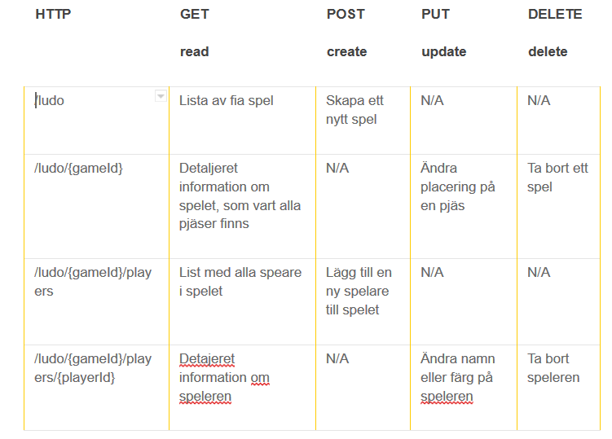

# LudoGame

### Bild på API.  
Vi har utgått från Stephan Kaas Johansen GameEnginge, samt API beskrvining. För att skriva reseterande delar av API:et har vi tagit hjälp av sidor via google så som stackoverflow, microsoft docs mfl.

  

Uppgift beskrvningen: https://pgbfdh18.github.io/webbutveckling-backend/project3.html
Utevcklad av Lovedeep brar, Lena Person, Viktor Person och Phatchari Jansson
